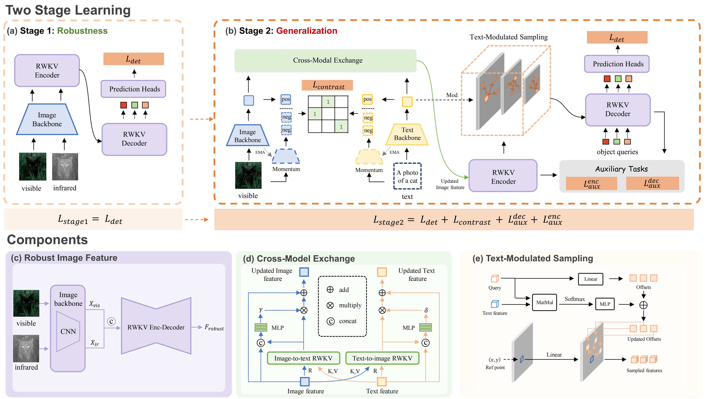

# C3-OWD: A Curriculum Cross-modal Contrastive Learning Framework for Open-World Detection<br>

This is the official repository for the paper:
> **C3-OWD: A Curriculum Cross-modal Contrastive Learning Framework for Open-World Detection**
>
> Siheng Wang\*<sup>†</sup>, Zhengdao Li\*, Yanshu Li, Canran Xiao, Haibo Zhan, Zhengtao Yao, Junhao Dong,  Xuzhi Zhang,  Jiale Kang,  Linshan Li,  Weiming Liu,  Zhikang Dong,  Jifeng Shen<sup>#†</sup>,  Qiang Sun<sup>#</sup>,  Piotr Koniusz <sup>#</sup>
>
> \*Equal contribution. <sup>†</sup>Project lead. <sup>#</sup>Corresponding author.
>


---

# 👋 Introduction

Object detection has advanced significantly in the closed-set setting, but real-world deployment remains limited by two challenges: poor generalization to unseen categories and insufficient robustness under adverse conditions. Prior research has explored these issues separately: visible-infrared detection improves robustness but lacks generalization, while open-world detection leverages vision-language alignment strategy for category diversity but struggles under extreme environments. This trade-off leaves robustness and diversity difficult to achieve simultaneously. To mitigate these issues, we propose **C3-OWD**, a curriculum cross-modal contrastive learning framework that unifies both strengths. Stage 1 enhances robustness by pretraining with RGBT data, while Stage 2 improves generalization via vision-language alignment. To prevent catastrophic forgetting between two stages, we introduce an Exponential Moving Average (EMA) mechanism that theoretically guarantees preservation of pre-stage performance with bounded parameter lag and function consistency. Experiments on FLIR, OV-COCO, and OV-LVIS demonstrate the effectiveness of our approach: C3-OWD achieves 80.1 $AP^{50}$ on FLIR, 48.6 $AP^{50}_{Novel}$ on OV-COCO, and 35.7 $mAP_r$ on OV-LVIS, establishing competitive performance across both robustness and diversity evaluations.  




## TODO List

- [x] Upload our paper to arXiv and build project pages.
- [x] Upload the code.
- [ ] Release C3-OWD model.

# 🤗 Prerequisite
<details> 
<summary>details</summary>
  
## Environment
```bash
conda create -n C3-OWD python=3.8.10 -y
pip install torch==1.13.0 torchvision==0.14.0 torchaudio==0.13.0
pip install -r requirements.txt
conda activate C3-OWD
```
We tested our environment on both A100 and H20.


### Prepare training dataset 
The COCO dataset and LVIS dataset should be organized as:
```
Co-DETR
└── data
    ├── coco
    │   ├── annotations
    │   │      ├── instances_train2017.json
    │   │      └── instances_val2017.json
    │   ├── train2017
    │   └── val2017
    │
    └── lvis_v1
        ├── annotations
        │      ├── lvis_v1_train.json
        │      └── lvis_v1_val.json
        ├── train2017
        └── val2017        
```
</details>

### Training
### 1.Stage 1
Train C3-OWD + ResNet-50 with 8 GPUs:
```shell
sh tools/dist_train.sh projects/configs/two_stream_codetr/codino_vit_twostream_640_autoaugv1_train1.py 8 path_to_exp_stage1
```


### 2.Stage 2
Train C3-OWD + ResNet-50 with 8 GPUs:
```shell
sh tools/dist_train.sh projects/configs/two_stream_codetr/codino_vit_twostream_640_autoaugv1_train2.py 8 path_to_exp_stage1
```

### Testing
Test C3-OWD + ResNet-50 with 8 GPUs, and evaluate:
```shell
sh tools/dist_test.sh  projects/configs/two_stream_codetr/codino_vit_twostream_640_autoaugv1_train2.py 8 --eval bbox
```

# 👍 Acknowlegements
We sincerely thank the open-sourcing of these works where our code is based on:

[DETR](https://github.com/facebookresearch/detr.git),
[Deformable-DETR](https://github.com/fundamentalvision/Deformable-DETR.git),
[Grounding-DINO](https://github.com/IDEA-Research/GroundingDINO.git),
[Co-DETR](https://github.com/Sense-X/Co-DETR.git)
[Vision-RWKV](https://github.com/OpenGVLab/Vision-RWKV.git)


## 🔒 License
This code is distributed under an [CC BY-NC-SA 4.0](https://creativecommons.org/licenses/by-nc-sa/4.0/deed.en).

Note that our code depends on other libraries, including CLIP, MMDetection, and uses datasets that each have their own respective licenses that must also be followed.
